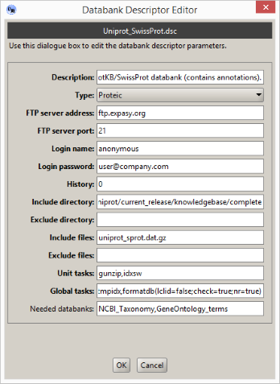

# Add a new bank descriptor

As explained previously, each public databank is described using a databank descriptor. Such an object contains required information enabling the automatic installation of a set of publicly available data files: location of the remote server, the list of files to retrieve and the post-processing tasks to apply.

## The concept of Databank Descriptor

To simplify the creation of a new databank descriptor, you will start from an existing one that will be used as a template.

For example, if you need to install a new proteic sequence databank, select an available proteic databank descriptor, then click on the  button; and so on for nucleotide or biological classification databank.

If you want to check the content of a databank descriptor, without creating a new one, click on the  button.

If you want to remove a descriptor, simply select it, then click on the  button \(this operation is not undoable\).

When using , you will open a first dialogue box inviting you to give a system name to your descriptor. When this is done, click on the \[Ok\] button to open the Databank Descriptor Editor. Since you have started the creation of a new descriptor from a template, the dialogue box fields are filled in with some values.

Now, you can edit these fields with new values, as follows.

Let us start with the more obvious fields. Enter a description \(free text\) for your databank, choose its type and set the values to connect to the remote FTP server: server address, server port \(usually it is 21\), user name \(usually it is the text 'anonymous', without the quotes\) and a password \(for an anonymous connection, public institutes usually ask for your email address\).

The field called "history" tells the Databank Manager how many backup copies of a databank it has to keep. Default value is zero to avoid an overlaod of your disk storage space, especially when dealing with very large databanks \(such as Genbank\).

Now, it is time to set which files the Databank Manager will have to download from the remote FTP server. First, use the field called "Remote dir" to set the directory location where the files are located on the server. Enter a simple path, a comma separated list of paths or [regular expressions](../getting-started/regular-expressions.md) if you need to scan several directories at once. Sometimes you may need to discard some other directories when using regexp to specify a set of directories to scan on the remote server. In that case, fill in the field called "Exclude dir" with appropriate values \(a simple path or a regexp\).

As soon as you have set which directories to scan, you have to set which files the Databank Manager has to download from these directories. For that purpose use the two fields "Include files" and "Exclude files" to set appropriate values. These fields accept either a simple file name or a comma separated list of file names or regular expressions, depending on what you need to retrieve.

Finally, you have to instruct the Databank Manager what to do with the downloaded data files. For example, sequence data files \(Genbank, Uniprot, etc.\) are available as compressed files. To be used by Korilog Databank Manager System to run BLAST search jobs, they have to be uncompressed, then converted to Fasta files and finally transformed to a Blast databank using the NCBI's 'formatdb' utility.

This is the purpose of the two fields [Unit tasks](../getting-started/descriptors-format/#unit-tasks) and [Global tasks](../getting-started/descriptors-format/#global-tasks) to let you specify what to do on each file \(unit task\) and on all files alltogether \(global task\). Each of these two fields have to be filled in with available system tasks.

