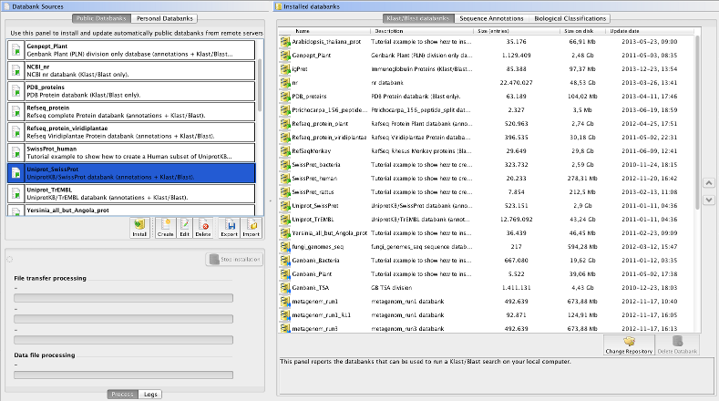

# Overview

The interface of the Databank Manager contains two panels. On the left side, you can see the panel Databanks Sources that let you choose which databank to install. On the right side, you can see the panel Installed Databanks which displays the list of databanks installed on your system; actually, that list is divided into three sub-list: Blast Databanks, Sequence Annotations and Biological Classifications.

The Databank Manager provides two major ways to install databanks: from FTP servers \(public institutes or in-house servers\) and from your personal data files. In both cases, you will use the left panel to start an installation job.

