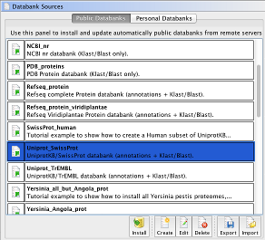
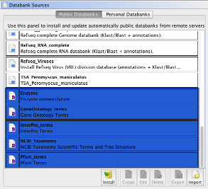
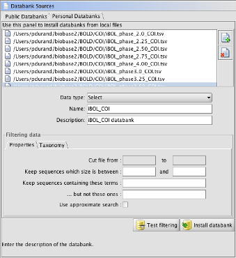
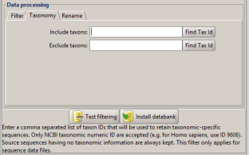
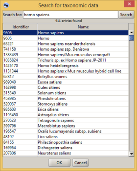
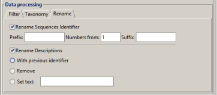
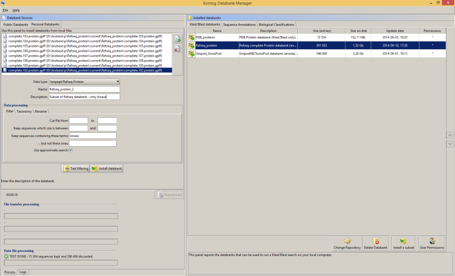

# Install databanks

## Install public databanks

Within the Databanks Sources panel, select the tab called Public Databanks. There, you can see a list of pre-configured databank descriptors.


Each descriptor contains the relevant information enabling the software to install a particular databank: location of the remote server and the list of files to retrieve. You will see later on how to edit and add a new databank descriptor.


Usually, a databank descriptor relating to sequence databanks (Genbank, Swissprot, etc.) can be used to deploy locally two types of banks: a Klast databank to be used to run sequence comparison jobs and a sequence annotation bank (also called index) to be used for sequence data retrieval tasks.


Not only a databank descriptor provides the material to install a databank, it can also be used to get some information before the installation: availability of the remote server, number of files to download, size of the data to download and an estimation of the databank size on your disk storage after installation.


If you want to install a particular databank, or if you want to get its information without installing it, simply select the corresponding descriptor in the list, and click on the   button. The Databank Manager will ask you if you want ot see the databank information before its installation: answer [Yes]. After a short period of time, during which the Databank Manager queries the remote server, a dialogue box will appear to display the databank information. Click on the [Cancel] button to close the dialogue box if you do not want to start the install. On the other hand, if you click on the [Install] button, the Databank Manager will provide you with the Installation Scheduler dialogue box. Use it to set up when you want to install the databank and click on the [Ok] button.


It is worth noting that Korilog Databank Manager System has to be up and running when a databank installation has been scheduled. Otherwise, the task will not be executed.


When an installation task is running, you can monitor it using the bottom part of the Databanks Sources panel. The Process sub-panel displays two progress bars that give you a simplyfied overview of what is going on. Use the Logs sub-panel to get a more detailed view of the installation processing.


You have two options if you want to install a databank not listed in the Public Databanks panel:

* option 1: create the appropriate databank descriptor
* option 2: install the databank using the Personal Databank panel

Using option 1 requires that sequence data files are available from FTP servers, and that you know which files to retrieve from these servers. Within KDMS, you create a new databank descriptor from an existing one: select an existing descriptor that is similar to the new databank you want to install, then click on the [Create] button. Finally, follow the instructions of the software. More information is available below.


Using option 2 requires you have the sequence data files already on your local computer. See section "Installing personal databanks" for more information.


## Install biological classifications

One of the major features of the software is its capability to introduce biological classification data within the BLAST results. To enable this feature, you have to install two types of databanks:


* the biological classifications managed by KDMS; they are listed by the end of the Public databanks panel: Enzyme, GeneOntology_terms, InterPro_term and NCBI_Taxonomy
* a reference sequence databank that is annotated with such classifications; a very well known example is Uniprot_Swissprot


So, you have to install the above mentioned classifications and annotated reference sequence databanks before any attempt to produce KLAST results containing biological classification data.



## Install personal databanks

Within the Databanks Sources panel, select the tab called Personal Databanks. There, you can see a panel that will enable you to provide various sequence files that will be converted to Klast/Blast databanks. This panel is also the entry point to add annotated sequence databanks. Accepted formats are: Genbank, Refseq, Embl, Genpept, Swissprot, TrEmbl and Fasta.


To format a set of sequence files to be used with Klast/Blast system, proceed as follows:

* switch to the Databank Manager module, then select the Personal Databanks tab in the Databank Sources panel (left side of the module's panel)


* provide the set of file(s) to prepare. You can provide several sequence files at once, however be sure that they are all of the same sequence type (proteic or nucleotide). Accepted sequence file formats are: Genbank, Refseq, Embl, Genpept, Swissprot, TrEmbl and Fasta, either in plain text or gzipped (please note that gzipped files must have the .gz file extension). Then, select the sequence type and enter the name of the databank. Finally, click on the [Create DB] button.


* When the software terminates the installation of your databank, you will see it on the right panel of the Databank Manager module, Klast/Blast Databanks tab (prepared from Fasta files), or Sequence Annotations tab (prepared from annotated sequence files).


When you provide sequence files to Korilog Databank Manager System, you should verify their content and especially check that sequence identifiers are unique and well formatted. Well formatted sequence IDs means that they follow the NCBI recommendations.


Here is an example of the installation of COI DNA barcoding data sets. Source files have been manually retrieved from the BOLD data server (http://www.boldsystems.org/index.php/datarelease), then KLAST Databank Manager has been setup as follows:


It is worth noting that you have first to install the NCBI Taxonomy classification before installing taxonomy-based sequence data sets (Silva and BOLD).

The Personal Databanks panel contains some controls to filter sequences. These controls can be used to retain or discard sequences using the following criteria:


* sequence rank order: keep the sequences whose rank order is after from and before to for each file

* sequence size

* sequence description


* taxonomy; filtering sequences using taxonomy data is only possible if the source files contained such information. In all cases, using taxonomy filters required to install the NCBI Taxonomy classification.


You can find a taxon ID using the "Find Tax Id" button. Just fill in the Search for field with a taxonomy term, an approximate term or a regular expression. In this example, even if we are looking for Homo spaiens, the taxonomic engine will return Homo sapiens:


In addition to filtering, you can rename all the sequences IDs and/or descriptions using the "Rename" tab.


Since the full installation of a databank may take a long time, you can use the [Test filtering] button just to check whether or not your filter fulfill your needs. Testing a filter does not install a databank.

## Install a databank subset

To install a subset of an installed databank, select the databank of interest and clic on the [Install a subset] button located at the bottom of "Installed databank" panel. The Personnal Databank panel is shown and automatically filled in with the original files selected databank. You can now filter these files according to your needs. In the following example, a subset of the installed Refseq_protein databank has been filtered to keep only sequences which concerns kinase:


## Prepare taxonomic specific data subsets

The panel Install Personal Databanks enables you to prepare taxonomic specific data subsets. For that purpose, use one or the two fields called 'Include taxons' and 'Exclude taxons'. Both of them accept a comma separated list of taxon IDs that will be used to retain (include taxons) or discard (exclude taxons) taxonomic-specific sequences. Only NCBI taxonomic numeric ID are accepted (e.g. for Homo sapiens, use ID 9606). The use of these constraints only apply for sequence data files containing taxonomic data (Genbank, Refseq, Embl, Genpept, Swissprot, TrEmbl). Source sequences having no taxonomic information are always kept for inclusion in sequence annotation and Blast databanks.
