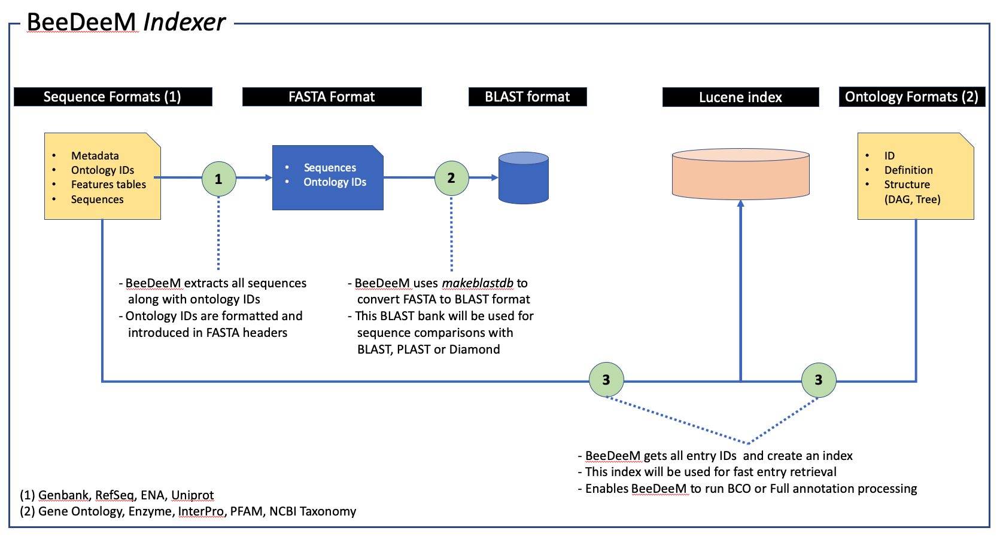
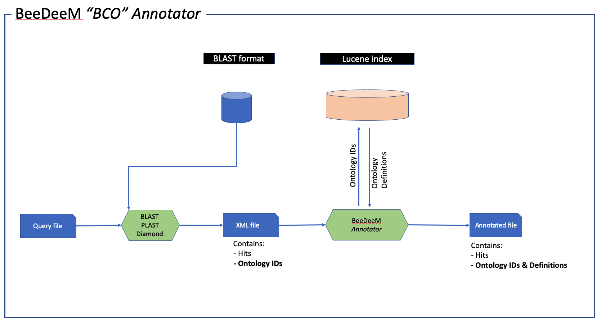
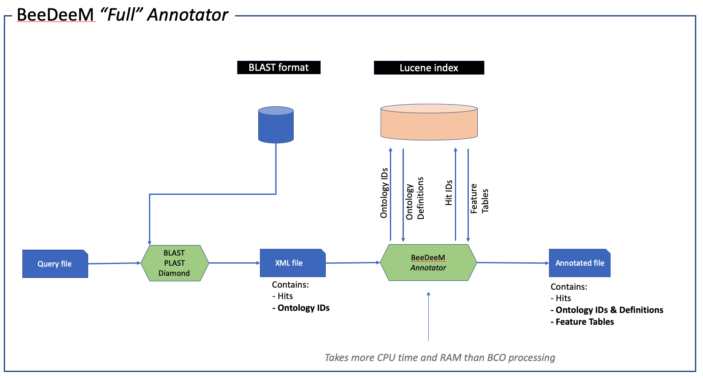

# Annotate BLAST results

_BeeDeeM_ comes with an additional tool aims at annotating BLAST results. This annotation processing means to introduce features data within each HSP contained in a BLAST result. That information is, of course, retrieved from the databanks managed by _BeeDeeM_.

That tool is only available from the command line and is called:

* annotate.sh: to be used on Linux or Mac OSX system
* annotate.bat: to be used on Windows system

_Note:_ during script execution, there is nothing displayed on the terminal whether something goes OK or wrong. However, _BeeDeeM_ logs all its work in a dedicated log file located in ${workingDir}. Refer to [Directory structure](../installation/directory_structure.md) for more information.

## Annotation explained

"Annotating" a BLAST result means adding two types of information to the XML BLAST result files :

* Ontology data, namely IDs and descriptions from Gene Ontology, Enzyme, InterPro, PFAM or NCBI Taxonomy, if any are available in the reference bank;
* Feature tables located on matching regions of hits.

**How all of these can happen?**

First of all, you have to understand that during the installation of a bank, either a sequence one \(e.g. SwissProt\) or an ontology one \(e.g. Gene Ontology\), BeeDeeM prepares data into dedicated indexes as illustrated here:



Then, you have to understand that a BLAST XML file produced from a BLAST bank prepared by BeeDeeM contains both Hits IDs **and** Ontology IDs. BeeDeeM annotator will be capable of using all these IDs to gather very useful data from sequence and ontology banks installed by BeeDeeM, too.

Finally, you have two know that BeeDeeM provides two types of "annotation" processing: **BCO** or **Full**, as illustrated here:





## Requirements to use BeeDeeM Annotator

* BLAST searches have to be done against BLAST databanks prepared by _BeeDeeM_; use the [info](list-banks.md) tool to list BLAST banks that also contains annotations;
* use either legacy BLAST or BLAST+ software;
* set BLAST program to produce results formatted as XML \(legacy or XML2\).

## How to produce a BLAST XML result file?

For instance, you can produce a legacy NCBI XML BLAST file using the following argument of BLAST+:

```text
-outfmt 5
```

For those of you that are still using the legacy BLAST \(_i.e. blastall_\), use this argument:

```text
-m 7
```

## Command-line use

Command line takes three arguments, in this order:

```text
annotate.sh -i <BLAST result> -o <output file> -type <type> -writer <writer>
```

* **BLAST result** \[_required_\]: input BLAST file that has to be annotated \(absolute path\); must be legacy BLAST XML formatted; 
* **output file** \[_required_\]: output file that will contain the annotated BLAST result \(absolute path\); 
* **type** \[_required_\]: type of annotation to retrieve. Use one of: bco or full. Use "bco" to only retrieve biological classifications information. Use "full" to retrieve full feature tables.
* **writer** \[_required_\]: writing format. Use one of: xml or zml. Use zml to save feactures and classification data. Use xml to save using NCBI legacy XML format.

Run program "annotate.sh" without any arguments to review command-line usage.

[Sample use case](../installation/test_install/#annotate-a-blast-result).

In addition, some parameters can be passed to the JVM for special configuration purposes:

* -DKL\_DEBUG=true ; if true, log will be in debug mode
* -DKL\_WORKING\_DIR=an\_absolute\_path ; if not set, log and working directories are set to java.io.tmp
* -DKL\_LOG\_FILE=a\_file\_name ; if set, creates a log file with that name within KL\_WORKING\_DIR

## Output format

This program produces an output file using a dedicated format that can represent a BLAST results containing Feature Tables \(original BLAST XML format does not handle that\).

In turn, such files can only be handled using:

* [BLAST Viewer](https://github.com/pgdurand/BlastViewer) tool
* [BLAST Filter](https://github.com/pgdurand/BLAST-Filter-Tool) Tool
* [Plealog Bioinformatics Core API](https://github.com/pgdurand/BeeDeeM/wiki/Explore-annotated-BLAST-results)

The two former tools provide you with ready-to-use softwares to view and analyze annotated BLAST result files. The latter enables you to write your own Java-based tool to deal with such files in a convenient way. [More here](https://github.com/pgdurand/BeeDeeM/wiki/Explore-annotated-BLAST-results).

## List annotated banks

Use the [info](list-banks.md) tool to list banks that contains annotations.

